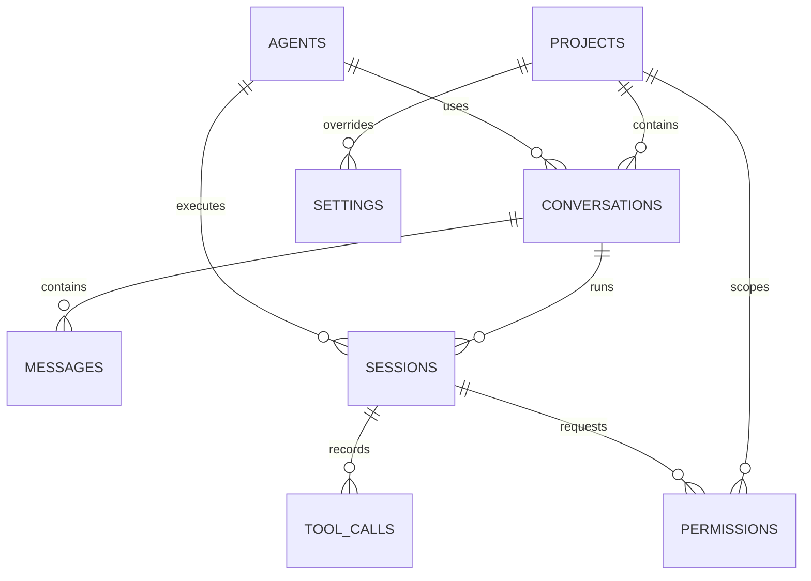

# KaifangWork · 档案治理 Agent 工作台

面向档案数据治理行业的 AI Native 桌面应用。把工作空间、任务、专家、插件、终端与执行记录组织在同一个工作台中，让人与 Agent 共同完成资料理解、识别、整理、校验与追踪。

这不打算做成聊天机器人，也不是把网页 Dashboard 搬进桌面：

> 用户通过任务提出目标，基础 Agent 负责理解、规划并调用工具，插件工具负责执行档案治理和业务操作，工作台负责呈现过程、结果和可回溯证据。

### 能力边界

采用「基础 Agent + 插件工具」的分层方式：

- **Pi Agent SDK 只承载基础 Agent 能力**：对话、工具调用、上下文管理、Harness。
- **档案治理和业务能力全部通过插件工具接入**：OCR、分类、元数据抽取、质量校验、格式处理、报告生成、外部业务系统连接。
- **桌面工作台承载体验和运行管理**：工作空间、任务、权限、插件生命周期、事件展示和日志；不把行业规则硬编码进基础 Agent。

### 视觉基调

**党政档案 · 纸质 · 朱红**：米白纸质底、朱红主色、墨色正文、宋体字面、2px 圆角、无阴影装饰。信息层级由排版、间距和低对比背景建立，不由卡片和彩色标签建立。

## 目录

- [项目状态](#项目状态)
- [快速开始](#快速开始)
- [当前实现](#当前实现)
- [桌面外壳](#桌面外壳)
- [渲染层架构](#渲染层架构)
- [界面规范](#界面规范)
- [组件与样式约定](#组件与样式约定)
- [任务呈现模型](#任务呈现模型)
- [设置页面](#设置页面)
- [规划：数据与存储](#规划数据与存储)
- [规划：基础 Agent 与插件工具](#规划基础-agent-与插件工具)
- [规划：OCR 插件工具与 Sidecar](#规划ocr-插件工具与-sidecar)
- [开发计划](#开发计划)
- [验收清单](#验收清单)
- [贡献指南](#贡献指南)
- [许可证](#许可证)

## 项目状态

| 模块            | 状态             | 说明                                                                                 |
| --------------- | ---------------- | ------------------------------------------------------------------------------------ |
| 工程与构建      | 已完成           | Electron 44 + Vue 3.5 + TypeScript 5.9 + electron-vite 5，pnpm 管理                  |
| 桌面外壳        | 已完成           | 无边框窗口、自绘标题栏、窗口控制 IPC、浅色/深色主题                                  |
| 工作台界面      | 已完成（空数据态） | 三栏布局、导航、任务执行区、设置页、目录页；领域数据由 `App.vue` 持有                 |
| 任务事件块      | 已完成（渲染层） | `TaskEventBlock.vue` 渲染 9 类事件块，尚未接入真实事件流                             |
| 基础 Agent 集成 | 规划中           | 接入 Pi Agent SDK 的对话、上下文、工具调用和 Harness                                 |
| 插件工具运行时  | 规划中           | 插件发现、注册、鉴权、调用与隔离                                                     |
| OCR / Sidecar   | 规划中           | Python + OCRmyPDF，由 OCR 插件工具封装                                               |
| 结构化存储      | 规划中           | SQLite + Filesystem + OS Keychain + Cache                                            |
| 测试套件        | 未配置           | 当前以 `pnpm lint`、`pnpm typecheck`、`pnpm build` 为门槛                            |

文中标注「规划」的部分代表尚未落地为代码；只有代码里存在的能力才视为已实现。

## 快速开始

环境要求：Node.js 24+、pnpm 10+，以及 Electron 所需的本机编译工具链。

```bash
pnpm install          # 安装依赖及原生应用依赖
pnpm dev              # 启动 Vite 和 Electron 开发环境
pnpm lint             # ESLint 检查
pnpm typecheck        # 主进程 / preload / 渲染进程类型检查
pnpm build            # 类型检查 + 生产构建
pnpm build:unpack     # 构建并打包未压缩应用
pnpm build:mac        # 平台安装包：build:win / build:mac / build:linux
pnpm format           # Prettier 全量格式化
```

模型提供方密钥、OCR 语言包等运行时依赖在对应能力落地时补充到本节，并按 macOS、Windows、Linux 分别说明。

## 当前实现

```text
.
├── src/
│   ├── main/index.ts              # 主进程：窗口、生命周期、窗口控制 IPC
│   ├── preload/
│   │   ├── index.ts               # contextBridge：window.electron + window.api
│   │   └── index.d.ts             # 渲染层 IPC 类型声明
│   └── renderer/
│       ├── index.html
│       └── src/
│           ├── main.ts            # 渲染入口
│           ├── App.vue            # 壳层：视图切换与全局状态
│           ├── theme.ts           # 主题状态与 data-theme 写入
│           ├── components/        # 全部界面组件（见下表）
│           ├── data/types.ts      # 领域类型
│           ├── data/settings.ts   # 设置项定义
│           └── assets/
│               ├── base.css       # 基础重置与字体
│               └── main.css       # 设计令牌、布局、原子类
├── resources/                     # 运行时资源（应用图标）
├── build/                         # 打包资源（图标、entitlements）
├── electron.vite.config.ts        # 三段构建配置 + @renderer 别名
├── electron-builder.yml           # 打包配置
└── tsconfig.{json,node,web}.json  # 引用式类型配置
```

技术栈：Electron 44 · Vue 3.5（`<script setup lang="ts">`，无 Router、无状态库）· TypeScript 5.9 strict · Vite 7 · electron-vite 5 · lucide-vue-next · Prettier + ESLint flat config。

渲染层不引入路由和状态管理库：视图切换和跨区域状态由 `App.vue` 直接持有，通过 props/emit 向下传递。领域类型集中在 `data/types.ts`，设置项定义集中在 `data/settings.ts`；接入持久化后由应用状态层替换空数据源，而不是在组件内散落数据。

## 桌面外壳

主进程 `src/main/index.ts`：

- 单窗口，默认 1180×760，最小 760×560，`frame: false` + `autoHideMenuBar`。
- 外部链接交由系统浏览器打开，窗口内导航一律拒绝。
- 注册窗口控制 IPC，并做 `BrowserWindow.fromWebContents(event.sender)` 归属校验。
- 仅 macOS 使用 `icon`（Linux 窗口图标），其余平台由打包配置处理。
- 应用 ID `com.kaifangwork.app`，产品名 `KaifangWork`。

窗口不使用系统标题栏，标题栏由渲染层自绘（`TitleBar.vue`）：

- macOS：自绘红/黄/绿交通灯（13px，hover 显示符号），左侧对齐。
- Windows / Linux：自绘最小化、最大化/还原、关闭按钮，右侧对齐。
- 整条标题栏 `-webkit-app-region: drag`，可交互元素显式 `no-drag`。

IPC 白名单目前只有窗口控制，通过 preload 暴露：

```ts
window.api.windowControls.minimize() // window:minimize
window.api.windowControls.toggleMaximize() // window:toggle-maximize
window.api.windowControls.close() // window:close
window.electron // @electron-toolkit/preload 提供的只读 API
```

窗口控制按钮属于平台窗口 chrome，沿用自绘细线 SVG，不受图标库约束。新增 IPC 必须同步更新 `src/preload/index.d.ts`。

## 渲染层架构

### 状态与视图

`App.vue` 是唯一的壳层状态持有者：

| 状态                     | 含义                                                                   |
| ------------------------ | ---------------------------------------------------------------------- |
| `view`                   | 当前视图：`task` \| `settings` \| `workspace` \| `talent` \| `library` |
| `taskId` / `workspaceId` | 当前任务与工作空间                                                     |
| `asideVisible`           | 右侧状态信息区是否显示（仅 `task` 视图生效）                           |
| `model` / `mode`         | 输入区当前的模型与模式                                                 |

事件由子组件 emit 回壳层：`select-task`、`new-task`、`open-settings`、`open-view`、`submit`、`toggle-aside`、`update:model`、`update:mode`。新增界面能力时优先沿用这套单向数据流，不要在组件内部另起一份全局状态。

### 组件清单

| 组件                 | 职责                                                                                   |
| -------------------- | -------------------------------------------------------------------------------------- |
| `AppIcon.vue`        | 渲染层唯一的图标入口，语义名 → Lucide 组件映射                                         |
| `AppSelect.vue`      | 自绘下拉：`Teleport` 到 body，按触发器测量定位（空间不足时上翻、右对齐），支持键盘导航 |
| `TitleBar.vue`       | 自绘窗口 chrome 与窗口控制调用                                                         |
| `AppSidebar.vue`     | 左侧导航：品牌、新建任务、功能菜单、任务 / 工作空间文件分组与搜索                     |
| `UserMenu.vue`       | 左侧导航底部账号入口，菜单向上弹出（设置 / 账号 / 关于）                               |
| `TaskView.vue`       | 中央任务执行区：任务头部、事件流、底部输入区                                           |
| `TaskEventBlock.vue` | 单个执行事件块的渲染，覆盖 9 类 block                                                  |
| `SettingsView.vue`   | 设置页：左侧分类 + 右侧连续设置行                                                      |
| `DirectoryView.vue`  | 表格式列表页：工作空间 / 专家·技能 / 知识库                                            |

组件保持单一职责：`TaskView` 只负责布局与交互事件，事件块样式与状态映射留在 `TaskEventBlock`；列表类页面共用 `DirectoryView`，由 `kind` 决定数据与标题。

## 界面规范

### 整体风格

现代、专业、克制的桌面工具风格，体验参考 AI Coding Agent 与 IDE，但不复制任何现有产品。

关键词：`AI Native` · `极简` · `高信息密度` · `强层级` · `低视觉噪音` · `纸质档案感`

### 三栏布局

```text
┌────────────────┬───────────────────────────────────┬──────────────┐
│ 左侧导航 244px │ 中央工作区 flex                    │ 状态信息 300px│
├────────────────┼───────────────────────────────────┼──────────────┤
│ 标题栏(chrome) │ 任务名 · 操作                         │              │
│ 品牌 / 新建任务│                                   │ （预留：     │
│ 工作空间       │ 事件流：文本、计划、工具调用、     │  步骤、统计、│
│ 专家 / 技能    │ 终端输出、Diff、确认、提示、代码、 │  权限、摘要）│
│ 知识库         │ 阶段小结                           │              │
│ ──────────────│                                   │              │
│ 任务(10)       │                                   │              │
│ 工作空间(10)   │                                   │              │
│ ──────────────│                                   │              │
│ 头像 / 用户名  │ 输入区：上下文 · 附件 · 模型 · 模式│              │
└────────────────┴───────────────────────────────────┴──────────────┘
```

布局由 `main.css` 的栅格实现：`grid-template-columns: var(--sidebar-w) minmax(0, 1fr) var(--panel-w)`；隐藏右侧时切到 `.is-aside-hidden` 的两列。左侧 `244px`、右侧 `300px`、最小窗口宽度 `760px` 均由令牌固定。

三块区域统一使用 `.pane`（`--side` / `--main` / `--aside`）承载：左侧与右侧为 `--bg-panel` 并带内侧分隔线，中央为 `--bg`。右侧状态信息区目前是占位 `<aside>`，后续按「当前步骤、文件统计、工具权限、最近调用、待确认、摘要入口」填充，不承担第二个聊天区。

### 设计令牌

`assets/main.css` 定义全部颜色与尺寸令牌，使用 `color-scheme: light dark` + `light-dark()` 自动跟随系统：

| 令牌                                                        | 用途                                             |
| ----------------------------------------------------------- | ------------------------------------------------ |
| `--bg` / `--bg-panel` / `--bg-inset` / `--bg-elevated`      | 底、面板、内嵌输入、极低对比内容块               |
| `--bg-hover` / `--bg-active` / `--bg-selected`              | 悬停、激活、选中背景                             |
| `--line` / `--line-strong`                                  | 分隔线与强调边框                                 |
| `--text` / `--text-2` / `--text-3`                          | 正文色；当前后两者同等正文色，不使用浅灰承载正文 |
| `--accent` / `--accent-soft`                                | 朱红主色与淡底                                   |
| `--ok` / `--warn` / `--err` / `--info`                      | 状态色，只表达状态                               |
| `--font-ui` / `--mono`                                      | 宋体字面；`.mono` 目前复用正文字体，保留类名语义 |
| `--radius`（2px）`--sidebar-w`（244px）`--panel-w`（300px） | 圆角与布局尺寸                                   |

新颜色、间距、圆角一律先补令牌，不在组件里写裸色值（状态色的低透明底除外）。

### 主题

`theme.ts` 维护主题状态：`system`（跟随系统，默认）、`light`、`dark`。

- 未设置 `data-theme` 时由 `light-dark()` 解析系统主题；只在用户显式选择时写入 `data-theme`。
- 主题切换入口在外观设置分类，通过 `setThemeByLabel` / `themeLabel` / `themeOptions` 读写，不直接操作 DOM 属性。
- 深浅两套色值由 `light-dark()` 就近声明，避免维护两份选择器。

### 图标

- 界面图标唯一来源为 [Lucide](https://lucide.dev/icons/)，通过 `lucide-vue-next` 引入。
- 渲染层只通过 `AppIcon.vue` 使用图标：先在 lucide.dev 检索，再在 `icons` 映射表按语义名登记；组件不各自 import 图标。
- 默认 `size` 16、`stroke-width` 1.75，密集区域使用 12–14；颜色继承 `currentColor`，不加背景、不单独染色。
- 语义相同的位置复用同一图标；不引入第二套图标库，不用 emoji 或位图替代。
- 已登记语义名：`plus` `search` `folder` `file` `history` `sliders` `help` `user` `users` `library` `pause` `stop` `play` `check` `alert` `x` `terminal` `copy` `clip` `clock` `chevron` `panel` `sparkle` `shield` `plug` `refresh`。
- 窗口控制按钮（最小化 / 最大化 / 关闭）属于平台窗口 chrome，保持自绘细线 SVG。

### 状态与文案

- 状态用状态图标表达：`.status` + `.status-dot` 配色类 `is-run`、`is-ok`、`is-warn`、`is-err`、`is-draft`；不使用带底色的文字标签或徽标。
- 文案只承载用户必须知道的信息：不写副标题、说明段落、字段提示和快捷键提示，解释性内容放文档里。
- 任务状态的中文呈现集中在组件内的状态映射表（例如 `TaskView`、`AppSidebar`），不散落文案。

### 视觉禁用项

- SaaS 官网式首屏、营销文案、Dashboard 模板感。
- 大量并列卡片、把每段内容都包进 Card。
- 过度圆角、厚重阴影、装饰性边框、渐变与霓虹色、花哨动画。
- 巨大标题和空旷留白。
- 手机 App 风格的底部 Tab 导航。
- 只展示最终答案而隐藏执行过程。

## 组件与样式约定

### 全局原子类

`main.css` 提供跨组件复用的基础类，组件优先复用而不是重写：

| 类                                                                 | 说明                                           |
| ------------------------------------------------------------------ | ---------------------------------------------- |
| `.pane` / `.pane--side` / `.pane--main` / `.pane--aside`           | 三栏容器                                       |
| `.scroll`                                                          | 统一滚动容器（`overscroll-behavior: contain`） |
| `.btn` / `--primary` / `--ghost` / `--icon` / `--sm`               | 按钮族                                         |
| `.input`                                                           | 文本输入                                       |
| `.switch` / `.is-on`                                               | 开关                                           |
| `.status` / `.status-dot` + `is-*`                                 | 状态点                                         |
| `.nav-item` / `.is-active` / `.nav-item__sub`                      | 导航项                                         |
| `.mono` / `.muted` / `.selectable` / `.divider` / `.section-label` | 文本与分隔工具类                               |

### 组件样式

- 组件样式写在 `<style scoped>`，类名采用块 + 修饰/元素：`.block__head`、`.menu-item.is-active`、`.selectbox--bare`、`selectbox--sm` 表示尺寸。
- 状态与尺寸用修饰类表达，不在模板里写内联样式（`AppIcon` 的旋转等一次性变换除外）。
- 只在需要分组、警示或隔离高风险操作时使用容器（边框 + `--bg-elevated`），列表和表单行用分隔线而非卡片。
- 交互控件默认无边框：hover 用背景变化表达，仅输入类控件保留边框。

### 新增组件检查

- 是否已有组件能覆盖（`DirectoryView`、`TaskEventBlock`、`AppSelect`）？
- 图标是否走 `AppIcon`，颜色是否走令牌？
- 交互元素是否处理了键盘与 `Esc` 关闭（参考 `AppSelect`、`UserMenu` 的 pointerdown/keydown 监听）？
- 是否需要 `-webkit-app-region: no-drag`（位于标题栏或任务头部的可点击元素）？

## 任务呈现模型

### 任务状态

渲染层当前使用五个状态，中文呈现见 `TaskView`、`AppSidebar`：

| 状态                     | 呈现              | 色调                 | 可用操作             |
| ------------------------ | ----------------- | -------------------- | -------------------- |
| `Draft`                  | 草稿              | 空心点               | 提交                 |
| `Running`                | 执行中 / 等待确认 | `is-run` / `is-warn` | 暂停、取消、查看过程 |
| `WaitingForConfirmation` | 等待确认          | `is-warn`            | 批准、拒绝           |
| `Succeeded`              | 已完成            | `is-ok`              | 查看结果、再次运行   |
| `Failed`                 | 失败              | `is-err`             | 查看错误、重试       |

接入真实执行后补齐 `Queued`、`Paused`、`Cancelled` 等状态，并要求状态转换可追踪、可恢复、幂等。

### 事件块

Agent 过程以块序列呈现，类型定义在 `data/types.ts`，渲染在 `TaskEventBlock.vue`：

| `kind`     | 内容     | 呈现要点                                                         |
| ---------- | -------- | ---------------------------------------------------------------- |
| `user`     | 用户目标 | 正文段落，无气泡                                                 |
| `text`     | 助手文本 | 保留换行的自然文档流                                             |
| `plan`     | 执行计划 | 步骤列表 + `done/active/todo` 状态标记                           |
| `tool`     | 工具调用 | 工具名、插件与版本、调用原因、输入、输出、耗时、状态、可选进度条 |
| `terminal` | 终端输出 | 折叠式代码块 + 复制                                              |
| `diff`     | 文件变更 | 逐行 `add/del/ctx` 着色                                          |
| `confirm`  | 需要确认 | 原因、操作、影响范围 + 批准/拒绝，决策后转为状态点               |
| `notice`   | 状态提示 | `info/ok/warn/error` 四级色调                                    |
| `code`     | 代码     | 语言标签 + 复制                                                  |
| `summary`  | 阶段小结 | 统计项 + 下一步建议                                              |

工具调用至少回答：调用了哪个工具、来自内置还是哪个插件、为什么调用、关键参数、影响范围、状态与耗时、失败后如何继续。长输出默认折叠或限高（终端 260px、Diff 200px）。

### 输入区

固定在中央工作区底部，由上下文行、输入框、工具栏三段组成：

- 多行 `textarea`，`field-sizing: content` 自动增高，最大高度 168px。
- 上下文行展示当前目录、附件数量、权限提示。
- 工具栏：添加附件、添加上下文、`@` 引用文件、模型选择、模式选择、提交/暂停。
- 提交按钮文案随状态变化（草稿/执行中为「提交」，结束态为「再次运行」），空输入时禁用。

已实现的快捷键：

| 快捷键          | 行为                         |
| --------------- | ---------------------------- |
| `Enter`         | 提交（忽略输入法组合态）     |
| `Shift + Enter` | 换行                         |
| `Esc`           | 关闭当前弹层、取消输入框焦点 |

规划中：`Cmd/Ctrl + Enter` 提交、`Cmd/Ctrl + K` 命令搜索、`Cmd/Ctrl + P` 快速查找；落地时需兼容 macOS 与 Windows/Linux 修饰键差异，并在设置页可查看调整。

## 设置页面

Desktop Preference 风格：左侧分类导航，右侧连续设置行。控件类型为 `switch`、`select`、`text`、`keybinding`、`action`，行采用 `label + 控件` 两列栅格，默认用分隔线分组，只有高风险操作行才使用危险色边框。

| 分类  | 内容                                                             |
| ----- | ---------------------------------------------------------------- |
| 常规  | 界面语言、高风险操作确认策略、启动时恢复未完成任务               |
| 外观  | 主题、字号、信息密度、右侧状态信息区、Markdown 表格等宽          |
| 模型  | 提供方、默认模型、温度、上下文长度上限、凭证重新授权             |
| Agent | 基础指令引用、默认模式、最大步骤数、自动批准策略                 |
| 终端  | Shell、工作目录、命令超时、执行前确认                            |
| Git   | 展示 Git 状态、Diff 方式、提交前确认                             |
| 集成  | HTTP 代理、业务系统连接器、插件管理                              |
| 高级  | 日志目录、调试模式、实验性功能、清理缓存                         |

设置项定义集中在 `data/settings.ts` 的 `settingsSections`；接入持久化后，分类与项的名称保持稳定，值改由设置服务读写。不要把每一项设置都放进独立 Card。

## 规划：数据与存储

本地优先方案，四类存储边界明确，由主进程提供统一服务，渲染层与插件不得自行决定物理位置。

| 存储层      | 保存内容                                                       | 不保存                   | 生命周期                     |
| ----------- | -------------------------------------------------------------- | ------------------------ | ---------------------------- |
| SQLite      | 对话、消息、会话、Agent 配置、工具调用、权限、项目、非敏感设置 | 大二进制、明文凭证       | 随应用与项目持久化           |
| Filesystem  | Skills、Agent 定义、工作空间文件、附件、产物                   | API Key、OAuth Token     | 按项目/任务/用户操作管理     |
| OS Keychain | 模型 API Key、OAuth Token                                      | 对话、业务数据、普通配置 | 由用户授权、撤销、重新授权   |
| Cache       | 模型缓存、MCP 缓存、临时文件                                   | 任何不可恢复的业务数据   | 可按大小、TTL 或用户操作清理 |

```text
Electron App
├── SQLite       conversations / messages / sessions / agents
│                tool_calls / permissions / projects / settings
├── Filesystem   skills/ agents/ workspaces/ artifacts/ attachments/
├── OS Keychain  OpenAI / Anthropic / DeepSeek API Key、OAuth Tokens
└── Cache        model cache / MCP cache / temporary files
```

关键约定：

- 结构化元数据与执行审计入 SQLite，文件本体入 Filesystem，通过稳定 ID 与相对路径关联。
- 使用迁移版本管理表结构，开启外键约束；已发布的迁移文件不得修改。
- 大型终端输出、二进制内容不写入 SQLite，只保存路径、大小、MIME 和校验值。
- `sessions` / `tool_calls` 支持增量写入，应用崩溃后能识别未完成运行并恢复或标记为 `Interrupted`。
- 任何文件写入都经过主进程路径校验，并优先写临时文件后原子替换。
- 删除操作必须区分数据库记录、应用管理的文件、用户原始文件、Keychain 凭证与缓存，禁止一个「清空数据」无差别删除。
- 备份包含数据库与受管理目录，排除 Keychain 与 Cache；恢复先校验 manifest、校验值和 schema 版本，再执行迁移，最后要求重新授权。

实体关系（推荐边界，不限定 ORM）：



典型任务的存储流程：创建对话与任务 → 创建 `sessions` → 基础 Agent 读取上下文（凭证由主进程从 Keychain 取）→ 每次工具调用写入 `tool_calls` → 插件读写授权工作空间并把产物落到 `artifacts/` → 结构化结果回写 SQLite → UI 通过事件流增量展示 → 完成后写入摘要。

## 规划：基础 Agent 与插件工具

### 分层职责

| 层级                      | 职责                                                            | 不承载                            |
| ------------------------- | --------------------------------------------------------------- | --------------------------------- |
| Pi Agent SDK / 基础 Agent | 对话循环、上下文组装、工具选择与调用、Harness、基础事件流       | 档案分类规则、字段定义、行业流程  |
| 工作台宿主                | 工作空间、任务生命周期、IPC、权限、插件加载、运行状态、日志、UI | 档案治理算法与业务规则            |
| 插件工具                  | 提供档案治理与业务能力，返回结构化结果                          | 修改基础 Agent 内核、绕过宿主权限 |
| Sidecar / 外部服务        | 重型计算与外部系统操作                                          | 决定任务整体流程                  |

### 调用链

```text
用户目标
  → 创建或恢复任务，收集工作空间与附件上下文
  → 基础 Agent 规划步骤，按工具描述选择插件工具
  → 宿主校验插件版本、参数、权限与工作空间范围
  → 插件执行领域逻辑，调用文件能力 / Sidecar / 外部服务
  → 返回结构化结果与可复核证据
  → 宿主生成事件，基础 Agent 继续编排
  → 生成任务摘要
```

### 插件工具契约

```ts
type PluginToolDefinition = {
  name: string
  description: string
  inputSchema: unknown
  outputSchema: unknown
  permissions: Array<'workspace.read' | 'workspace.write' | 'network' | 'process'>
  sideEffects: Array<'none' | 'create-file' | 'update-file' | 'external-write'>
  execute(input: unknown, context: PluginToolContext): Promise<PluginToolResult>
}

type PluginToolResult = {
  status: 'succeeded' | 'failed' | 'cancelled' | 'needs-review'
  data?: unknown
  sources?: Array<{ path: string; page?: number; locator?: string }>
  warnings?: string[]
  errors?: string[]
}
```

插件可以声明工具、声明输入输出与权限副作用、调用本地能力与已授权服务、在自身边界内维护领域规则；不得修改对话循环、绕过宿主权限、向渲染层注入脚本、只返回不可解析的自然语言。

样例工具名（正式命名以插件协议为准）：`archive.ocr`、`archive.classify`、`archive.extractMetadata`、`archive.validate`、`archive.generateReport`、`business.*`。

### 权限与确认

| 权限              | 场景                       | 默认策略             |
| ----------------- | -------------------------- | -------------------- |
| `workspace.read`  | 读取工作空间文件           | 可按任务授权         |
| `workspace.write` | 创建或修改结果文件         | 预览或确认后执行     |
| `process`         | 调用 OCR、转换器等本地进程 | 明确授权并限制参数   |
| `network`         | 访问模型、外部服务         | 按插件与任务分别授权 |
| `external-write`  | 写回外部业务系统           | 始终确认并记录审计   |

默认最小权限、读写分离、范围隔离；权限变更需在 UI 可见并进入审计日志；插件异常不得拖垮主应用或丢失任务状态。

### 事件模型

Agent 输出统一为可序列化事件，而不是只传最终字符串：

```ts
type TaskEvent =
  | { type: 'task.started'; taskId: string; timestamp: string }
  | { type: 'assistant.delta'; taskId: string; content: string }
  | {
      type: 'tool.started'
      taskId: string
      tool: string
      source: 'builtin' | 'plugin'
      pluginId?: string
      input: unknown
    }
  | { type: 'tool.progress'; taskId: string; message: string; progress?: number }
  | {
      type: 'tool.finished'
      taskId: string
      tool: string
      source: 'builtin' | 'plugin'
      pluginId?: string
      output: unknown
      durationMs: number
    }
  | {
      type: 'file.changed'
      taskId: string
      path: string
      change: 'created' | 'updated' | 'deleted'
    }
  | { type: 'confirmation.required'; taskId: string; reason: string; action: unknown }
  | { type: 'task.paused'; taskId: string; reason: string }
  | { type: 'task.failed'; taskId: string; error: string }
  | { type: 'task.finished'; taskId: string; summary: string }
```

事件落地时映射到 `TaskEventBlock` 的块类型，界面据此增量渲染，不等待任务结束后一次性刷新。

## 规划：OCR 插件工具与 Sidecar

OCR 以插件工具形式接入，由插件调用独立的 Python OCRmyPDF Sidecar；基础 Agent 不直接调用 Sidecar。

职责划分：

- **主应用**：检查运行环境，启停 Sidecar，分配任务 ID 并传递输入输出路径，读取进度与标准输出/错误，把退出码与错误映射为用户可理解的状态。
- **OCR 插件工具**：注册工具描述与输入输出结构，校验文件类型、工作空间范围和参数，转换请求与结果，按副作用声明触发预览、确认和审计。
- **Sidecar**：接收结构化请求、调用 OCRmyPDF、返回进度与结果；不暴露给基础 Agent，不做 UI，不保存会话，不决定任务是否继续。

接口约定（规划）：本机回环或标准输入输出通信；请求响应带版本号；每次请求携带 `requestId` 与 `taskId`；长任务支持进度、取消、超时；输出先写临时路径，校验后移动到目标位置；默认不覆盖原始文件。

```json
{
  "version": "1",
  "requestId": "req_123",
  "taskId": "task_456",
  "inputPath": "/workspace/incoming/document.pdf",
  "outputPath": "/workspace/output/document_ocr.pdf",
  "options": { "language": ["chi_sim", "eng"], "deskew": true }
}
```

## 开发计划

### 阶段一：桌面壳与基础工作台

- [x] 初始化 Electron、Vue 3、TypeScript 与 electron-vite 工程。
- [x] 主进程、渲染进程与受控 IPC（当前仅窗口控制）。
- [x] 三栏布局、导航、任务执行区、设置页、目录页（空数据态）。
- [x] 自绘标题栏、窗口控制与浅色/深色主题（默认跟随系统）。
- [ ] 建立统一的任务状态模型与事件模型，接入持久化数据流。
- [ ] 建立 SQLite 初始化、迁移、备份与恢复能力。
- [ ] 建立 Filesystem、OS Keychain、Cache 的统一访问服务。

### 阶段二：Agent 执行闭环

- [ ] 接入 Pi Agent SDK 的对话、上下文、工具调用与 Harness。
- [ ] 基础 Agent 仅通过统一工具契约调用能力，不内置档案治理逻辑。
- [ ] 支持增量文本、工具调用、进度与错误事件。
- [ ] 支持任务暂停、继续、取消与重试。
- [ ] 完成执行记录、右侧状态信息区与日志入口。

### 阶段三：插件工具运行时

- [ ] 插件发现、清单、版本与工具注册。
- [ ] 插件工具输入输出校验、权限检查与调用路由。
- [ ] 工具进度、取消、超时、失败恢复与结构化结果。
- [ ] 插件工具调用的界面展示、日志与审计记录。

### 阶段四：OCR 与档案治理插件

- [ ] 附件、工作空间文件与上下文引用。
- [ ] 以 OCR 插件工具接入 Python OCRmyPDF Sidecar。
- [ ] OCR 进度、取消、失败恢复与输出预览。
- [ ] 档案分类、抽取、校验、报告等业务插件工具。
- [ ] 插件安装、启停、授权与诊断。
- [ ] 回归样本与端到端任务测试集。

## 验收清单

每完成一个页面或一项能力，按以下清单自检。

### 产品体验

- [ ] 是否像桌面工具，而不是网站或营销页？
- [ ] 用户是否始终知道当前工作空间、任务和运行状态？
- [ ] 执行过程是否清晰、可理解、可回溯？
- [ ] 重要文件变更与外部操作是否有预览或确认？
- [ ] 失败后是否能看到原因并知道如何继续？

### 视觉与组件

- [ ] 是否复用 `.pane`、`.btn`、`.input`、`.switch`、`.status`、`.nav-item` 等全局类，而不是另起一套？
- [ ] 颜色与尺寸是否来自 CSS 令牌，组件里没有裸色值？
- [ ] 是否减少了不必要的 Card、边框和装饰？层级是否由排版、间距和低对比背景建立？
- [ ] 是否避免过度圆角、渐变、阴影与花哨动画？
- [ ] 图标是否全部经由 `AppIcon`，语义名已登记，尺寸 12–16、描边 1.75？
- [ ] 状态是否用状态点表达，而不是带底色的文字标签？
- [ ] 文案是否只包含用户必须知道的信息，没有副标题、字段提示与快捷键提示？

### 交互与工程

- [ ] 键盘操作是否完整，弹层是否支持 `Esc` 关闭与外部点击关闭？
- [ ] 长任务是否不阻塞界面？是否支持暂停、继续、取消或安全退出？
- [ ] IPC、文件系统、终端与插件权限是否经过校验？
- [ ] 新增 IPC 是否同步更新 `src/preload/index.d.ts`？
- [ ] SQLite、Filesystem、OS Keychain、Cache 是否遵守各自数据边界，凭证是否完全未落入数据库、文件、缓存与日志？
- [ ] `pnpm lint`、`pnpm typecheck`、`pnpm build` 是否通过，界面改动是否用 `pnpm dev` 冒烟验证？

## 贡献指南

1. 变更是否仍在产品目标范围内，没有把应用带向普通聊天机器人或 Dashboard 模板。
2. 涉及 Agent、工具、插件、Sidecar 或 IPC 的变更，是否说明了状态、权限、错误和恢复策略。
3. 涉及界面的变更，是否按[验收清单](#验收清单)检查桌面工具感、信息密度与键盘交互。
4. 涉及用户文件的变更，是否考虑了路径边界、覆盖策略、取消与失败恢复。
5. README、协议文档或架构图是否随产品约定同步更新。

提交信息使用简洁、可检索的前缀：

```text
feat: 增加任务执行时间线
fix: 修复窗口最大化状态未同步
refactor: 拆分事件块渲染分支
docs: 更新组件与样式约定
chore: 调整桌面端打包配置
```

## 许可证

当前仓库尚未声明正式许可证。确定后在此补充许可证名称、版权信息与第三方依赖许可说明。
