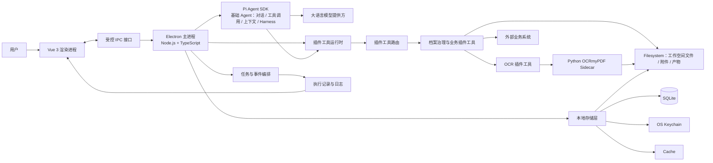
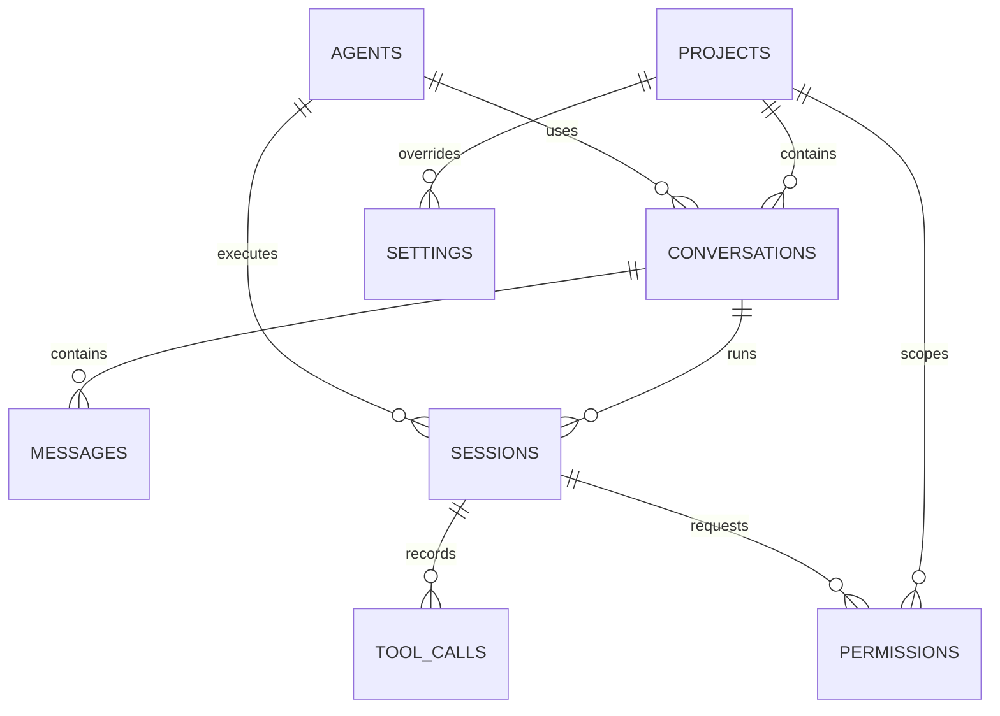

# Kaifang Agent 工作台

Kaifang Agent 工作台是一款面向档案数据治理行业的 AI Native 桌面应用。它把工作空间、任务、Agent、插件、终端与执行日志组织在同一个工作台中，让用户能够与一位专业的档案治理专家共同完成资料理解、识别、整理、校验与追踪工作。

本项目的目标不是做一个普通的聊天机器人，也不是把网页 Dashboard 搬到桌面端，而是构建一款具有 IDE 信息密度和桌面工具使用感的 Agent 应用：

> 用户通过任务提出目标，基础 Agent 负责理解、规划并调用工具，插件工具负责执行档案治理和业务操作，工作台负责呈现过程、结果和可回溯证据。

### 能力边界

本项目采用“基础 Agent + 插件工具”的分层方式：

- **Pi Agent SDK 只承载基础 Agent 能力**：基础对话、工具调用、上下文管理和 Harness（执行环境/运行时协作）。
- **档案治理和业务功能全部通过插件工具接入**：包括 OCR、档案分类、元数据抽取、质量校验、格式处理、报告生成以及外部业务系统连接。
- **桌面工作台负责承载体验和运行管理**：包括工作空间、任务、权限、插件生命周期、事件展示和日志，不把行业规则硬编码到基础 Agent 中。

这样可以让基础 Agent 保持通用、稳定、可替换，让档案治理能力能够通过插件独立开发、测试、升级和授权。

## 目录

- [快速开始](#快速开始)
- [项目状态](#项目状态)
- [产品定位](#产品定位)
- [核心概念](#核心概念)
- [技术方案](#技术方案)
- [系统架构](#系统架构)
- [存储架构](#存储架构)
- [功能范围](#功能范围)
- [界面与交互规范](#界面与交互规范)
- [基础 Agent 执行模型与插件协作](#基础-agent-执行模型与插件协作)
- [插件与工具设计](#插件与工具设计)
- [OCR 插件工具与 Sidecar](#ocr-插件工具与-sidecar)
- [数据、安全与可观测性](#数据安全与可观测性)
- [工程约定](#工程约定)
- [开发计划](#开发计划)
- [验收清单](#验收清单)
- [贡献指南](#贡献指南)
- [许可证](#许可证)

## 快速开始

当前仓库已完成 Electron + Vue 3 + TypeScript 桌面端初始化，使用 pnpm 管理依赖。

可执行以下命令：

```bash
# 安装依赖
pnpm install

# 启动开发环境
pnpm dev

# 执行代码检查与类型检查
pnpm lint
pnpm typecheck

# 构建桌面应用
pnpm build
```

### 开发环境要求（规划）

- Node.js 24 或更高版本，以及 pnpm。
- Electron 所需的本机编译工具链。
- Python 运行环境、OCRmyPDF 及其依赖。
- OCR 所需的语言包和系统级 PDF/图像依赖。
- 可用的模型提供方配置；密钥应通过本地安全存储或环境配置注入。

正式开发前应将具体版本、安装方式、环境变量名称和常见故障写入本节，并为 macOS、Windows 和 Linux 分别说明差异。

## 项目状态

当前仓库处于产品设计与工程搭建阶段。README 先行沉淀产品边界、交互原则和技术约束，后续实现应以本文档为共同基线。

| 模块 | 当前状态 | 说明 |
| --- | --- | --- |
| 产品定位与视觉方向 | 已确定 | 面向档案数据治理行业的专业桌面 Agent 工作台 |
| 桌面端技术路线 | 已确定 | Electron + Vue 3 + Node.js + TypeScript |
| 基础 Agent 集成 | 已确定 | [Pi Agent SDK](https://pi.dev/)，仅用于基础对话、工具调用、上下文管理和 Harness |
| 档案治理与业务能力 | 规划中 | 通过插件工具接入，不直接写入基础 Agent |
| OCR 能力 | 已确定 | Python + OCRmyPDF Sidecar，由 OCR 插件工具封装调用 |
| 本地存储架构 | 已确定 | SQLite + Filesystem + OS Keychain + Cache |
| 具体页面与组件实现 | 规划中 | 以本文档的页面与交互规范为验收依据 |
| 存储实现、模型配置与插件协议 | 待实现 | 实现时需要补充数据库迁移、凭证访问和正式协议文档 |

文档中的“规划”“建议”“待确定”代表尚未提交为代码的方案，不应被视为已经存在的命令、接口或功能。

## 产品定位

### 目标用户

- 需要处理大量电子档案、扫描件或非结构化资料的档案治理人员。
- 需要批量识别、分类、抽取、校验和整理档案数据的业务人员。
- 需要通过 Agent 编排重复性治理流程的专业用户。
- 需要查看处理依据、工具调用过程和异常记录的审核人员或技术人员。

### 要解决的问题

传统文件处理工具通常只能完成单点操作，用户需要在文件管理器、OCR 工具、脚本、终端和聊天窗口之间频繁切换，处理过程也难以追踪。Kaifang Agent 工作台希望解决以下问题：

1. 用自然语言描述治理目标，并将目标转化为可执行任务。
2. 将 Agent 的思考、工具调用、文件变化和结果整理在一个可回溯的任务上下文中。
3. 让 OCR、文件分析、批量处理等能力以工具或插件方式组合，而不是散落在多个应用中。
4. 在自动化效率与人工确认之间提供明确边界，重要操作可预览、可暂停、可取消。
5. 让每个结果都尽可能带有来源文件、处理步骤和状态信息，方便复核与追责。

### 设计目标

- **AI Native**：Agent 是工作流的核心，不是页面上的附加聊天框。
- **专业可信**：执行过程、风险操作和结果来源清晰可见。
- **高信息密度**：在有限桌面空间内展示足够的上下文、状态和细节。
- **克制耐用**：减少装饰性元素，让层级由排版、间距和细微背景建立。
- **可扩展**：模型、工具、插件和 Sidecar 能够独立演进。
- **可恢复**：任务支持暂停、继续、取消和失败后重试，避免长流程因单点异常完全丢失。

## 核心概念

| 概念 | 定义 | 典型内容 |
| --- | --- | --- |
| 工作空间（Workspace） | 一组相关文件、配置、任务和插件的工作边界 | 项目目录、模型设置、工具授权、任务历史 |
| 任务（Task） | 用户提出的一个目标及其完整执行记录 | 用户指令、上下文、Agent 运行、结果和日志 |
| 基础 Agent | 基于 Pi Agent SDK 的通用 Agent 运行能力 | 基础对话、工具调用、上下文管理、Harness |
| 工具（Tool） | Agent 可以调用的原子能力，业务能力以插件工具形式提供 | 文件读取、OCR、搜索、转换、终端命令 |
| 插件（Plugin） | 承载档案治理或业务能力的可安装扩展，并向 Agent 暴露工具 | 分类、抽取、校验、格式处理、外部系统连接 |
| 插件工具运行时 | 负责发现、注册、鉴权、调用和隔离插件工具 | 工具清单、参数校验、权限、超时、错误和结果 |
| Sidecar | 由主应用或插件工具管理的独立进程 | Python OCRmyPDF 服务、其他重型处理器 |
| 执行记录（Run） | 一次 Agent 从开始到结束的运行实例 | 输入、事件流、工具调用、输出、错误 |

建议在代码和数据结构中保持这些概念的边界，不要用“聊天记录”代替“任务”，也不要把“工具调用”直接等同于“消息气泡”。尤其要避免把档案治理规则直接写进基础 Agent；业务变化优先通过新增或升级插件工具完成。

### 分层职责

| 层级 | 主要职责 | 不应承载的内容 |
| --- | --- | --- |
| Pi Agent SDK / 基础 Agent | 对话循环、上下文组装、工具选择与调用、Harness 协作、基础事件流 | 档案分类规则、业务字段定义、行业流程和具体业务判断 |
| 工作台宿主 | 工作空间、任务生命周期、IPC、权限、插件加载、运行状态、日志和 UI | 具体档案治理算法和业务规则 |
| 插件工具 | 提供档案治理与业务功能，处理领域输入并返回结构化结果 | 修改基础 Agent 内核或绕过宿主权限 |
| Sidecar / 外部服务 | 执行特定的重型计算或外部系统操作 | 决定 Agent 任务整体流程 |

## 技术方案

| 层级 | 技术 | 职责 |
| --- | --- | --- |
| 桌面容器 | Electron | 窗口管理、系统集成、进程隔离、文件权限与应用生命周期 |
| 渲染层 | Vue 3 | 页面、组件、交互状态和桌面端 UI |
| 主进程与服务层 | Node.js + TypeScript | 基础 Agent 宿主、IPC、任务生命周期、插件运行时和 Sidecar 管理 |
| 基础 Agent 能力 | [Pi Agent SDK](https://pi.dev/) | 基础对话、工具调用、上下文管理和 Harness；不承载档案业务逻辑 |
| 插件工具层 | 插件机制（规划） | 以工具协议向基础 Agent 提供档案治理和业务能力 |
| OCR 插件执行器 | Python + [OCRmyPDF](https://ocrmypdf.readthedocs.io/) | 由 OCR 插件工具调用，为扫描型 PDF 添加 OCR 文本层 |
| 结构化数据存储 | SQLite | 对话、消息、会话、Agent 配置、工具调用、权限、项目和非敏感设置 |
| 文件存储 | Filesystem | Skills、Agent 定义、工作空间、附件、产物和本地文件 |
| 凭证存储 | OS Keychain | OpenAI、Anthropic、DeepSeek API Key 及 OAuth Token |
| 临时数据 | Cache | 模型缓存、MCP 缓存和可清理的临时文件 |

### 技术约束

- 渲染进程不应直接访问 Node.js 能力、文件系统或操作系统敏感 API；统一通过受控 IPC 暴露最小化接口。
- Pi Agent SDK 只保留基础对话、工具调用、上下文管理和 Harness 能力；不要在其内部加入档案治理或业务规则。
- 档案治理和业务功能必须以插件工具形式注册、授权和调用，基础 Agent 只通过统一工具接口使用它们。
- Agent、插件工具和 Sidecar 执行应由主进程或独立服务层承载，避免阻塞 UI。
- Python Sidecar 的启动、健康检查、标准输出、标准错误、退出码和异常信息必须可观测。
- 任务执行过程应采用事件流或等价的增量状态机制，让界面可以实时呈现，而不是等待任务结束后一次性刷新。
- 对可能修改、移动、删除或覆盖文件的操作，默认提供预览或确认机制。
- 结构化业务数据写入 SQLite，原始文件、附件和生成产物写入 Filesystem，二者通过稳定 ID 和相对路径关联。
- API Key 和 OAuth Token 只允许存放在 OS Keychain；SQLite、Filesystem 和 Cache 都不得保存明文凭证。
- Cache 只存放可重新生成的数据，不作为对话、任务、权限或业务结果的唯一数据源。
- 新增实现如果会改变产品约定，应同步更新 README 或补充专门的设计文档。

## 系统架构



### 推荐的调用链

```text
用户输入
  → 创建或恢复任务
  → 收集工作空间与用户补充上下文
  → 基础 Agent 规划执行步骤
  → 基础 Agent 通过统一工具协议调用插件工具
  → 插件工具执行档案治理或业务操作
  → 持续产生执行事件
  → UI 增量渲染状态与结果
  → 生成可复核的任务摘要
```

### 进程职责

#### 渲染进程（Renderer）

负责：

- 工作空间、任务、设置和插件页面的 UI 渲染。
- 输入框、附件、快捷键和交互反馈。
- 订阅任务事件并展示文本、Markdown、代码、Diff、工具调用和错误。
- 展示插件工具名称、权限提示、执行进度、结构化结果和业务结果摘要。
- 维护纯展示状态，避免在前端复制一套不可追踪的 Agent 执行逻辑。

不负责：

- 直接执行任意终端命令。
- 直接读写用户文件。
- 保存模型密钥或其他敏感凭证。
- 决定工具是否具有越权权限。
- 在前端实现档案治理规则或业务判断。

#### 主进程（Main）

负责：

- 创建窗口和管理应用生命周期。
- 通过 IPC 向渲染进程提供白名单 API。
- 创建、暂停、继续、取消和恢复任务。
- 调用 Pi Agent SDK 的基础对话、工具调用、上下文和 Harness 能力，并转发增量事件。
- 管理插件工具运行时、工具注册、权限检查和 Python Sidecar。
- 进行路径校验、权限检查、错误归类和审计记录。

#### Pi Agent SDK / 基础 Agent

Pi Agent SDK 在本项目中只作为基础 Agent 运行时使用，负责：

- 基础 Agent 对话和模型会话。
- 上下文收集、组装和传递。
- 根据任务上下文选择并调用工具。
- Harness 相关的执行环境协作。
- 将基础运行事件交给工作台展示和记录。

Pi Agent SDK 不负责档案分类、字段抽取、质量校验、OCR 业务流程或其他行业规则。这些能力必须由插件工具提供。

#### 插件工具运行时

插件工具运行时位于基础 Agent 与具体业务插件之间，负责：

- 发现插件、读取插件清单并注册工具。
- 校验工具输入和输出，执行权限、路径和参数检查。
- 将基础 Agent 的工具调用路由到对应插件。
- 处理超时、取消、重试、隔离和错误映射。
- 将插件结果转换为统一的任务事件和可展示结果。

#### Python OCRmyPDF Sidecar

负责耗时或依赖 Python 生态的 OCR 处理，由 OCR 插件工具封装后提供给基础 Agent 调用。Sidecar 不应直接暴露给基础 Agent，也不应直接负责 UI 或 Agent 决策，只接收结构化请求并返回结构化结果与进度信息。

## 存储架构

应用采用本地优先（Local-first）的存储方案，将结构化业务数据、文件内容、敏感凭证和可再生缓存分别放在不同的存储层中。四类存储各自有明确边界：

- **SQLite**：保存对话、消息、会话、Agent 配置、工具调用、权限、项目和非敏感设置等结构化数据。
- **Filesystem**：保存 Skills、Agent 定义、工作空间文件、附件和生成产物等文件型数据。
- **OS Keychain**：只保存模型 API Key、OAuth Token 等敏感凭证。
- **Cache**：保存模型缓存、MCP 缓存和临时文件，可随时清理并重新生成。

### 存储总览

```text
Electron App
│
├── SQLite
│   ├── conversations
│   ├── messages
│   ├── sessions
│   ├── agents
│   ├── tool_calls
│   ├── permissions
│   ├── projects
│   └── settings
│
├── Filesystem
│   ├── skills/
│   ├── agents/
│   ├── workspaces/
│   ├── artifacts/
│   └── attachments/
│
├── OS Keychain
│   ├── OpenAI API Key
│   ├── Anthropic API Key
│   ├── DeepSeek API Key
│   └── OAuth Tokens
│
└── Cache
    ├── model cache
    ├── MCP cache
    └── temporary files
```

### 存储层职责

| 存储层 | 保存内容 | 不保存的内容 | 生命周期 |
| --- | --- | --- | --- |
| SQLite | 可查询、可关联的结构化元数据和执行记录 | 大型二进制文件、明文凭证 | 随应用和项目持久化 |
| Filesystem | 原始文件、附件、Skills、Agent 定义和生成产物 | API Key、OAuth Token、临时会话密钥 | 按项目、任务和用户操作管理 |
| OS Keychain | 模型 API Key、OAuth Token 等秘密 | 对话、业务数据、普通配置 | 由用户授权、撤销和重新授权 |
| Cache | 模型、MCP 和临时处理缓存 | 任何不可恢复的业务数据 | 可按大小、TTL 或用户操作清理 |

实现时应由主进程提供统一存储服务，渲染进程和插件不得自行决定数据库、文件和凭证的物理位置。

### SQLite 数据模型

SQLite 是应用的结构化数据源，负责保存实体关系、任务状态和执行审计。建议所有记录使用稳定的字符串 ID，并统一保存 `created_at`、`updated_at`；涉及执行的记录还应保存 `started_at`、`finished_at` 和状态字段。

| 表 | 职责 | 关键关联与内容 |
| --- | --- | --- |
| `conversations` | 保存对话容器和任务上下文入口 | 关联 `projects`、`agents`，保存标题、状态、当前上下文摘要和最近活动时间 |
| `messages` | 保存用户、基础 Agent 和工具结果消息 | 关联 `conversations`、可选 `sessions`；保存角色、内容块、来源引用和附件/产物引用 |
| `sessions` | 保存一次基础 Agent 运行实例 | 关联 `conversations`、`agents`；保存模型、运行模式、Harness 上下文、状态、耗时和错误 |
| `agents` | 保存基础 Agent 配置和配置元数据 | 保存模型提供方、模型、基础指令引用、Harness 配置和可用工具引用；不保存档案业务实现 |
| `tool_calls` | 保存每一次工具调用及其结果摘要 | 关联 `sessions`；保存插件 ID、工具名、输入摘要、输出引用、状态、耗时和错误 |
| `permissions` | 保存工具、插件和外部服务的授权决策 | 关联项目、会话或插件；保存权限类型、资源范围、决策、操作者和有效期 |
| `projects` | 保存项目与工作空间元数据 | 保存名称、根路径、工作空间标识、启用的插件、最近打开时间和项目状态 |
| `settings` | 保存应用级和用户级非敏感设置 | 保存主题、快捷键、默认模型、行为偏好和 Keychain 引用；不得保存明文密钥 |

#### 推荐关系



关系图表达的是推荐的数据边界，不限制具体 ORM 或 SQLite 驱动。实现时应补充正式的建表脚本、索引、迁移和删除策略。

#### SQLite 设计约束

- 使用迁移版本管理表结构，禁止直接修改已发布的迁移文件。
- 开启外键约束，明确删除策略；对话删除不能留下无主的消息、会话和工具调用记录。
- 消息和工具结果采用内容块或 JSON 结构保存，但应为常用筛选字段建立独立列或索引。
- 大型终端输出、二进制内容和生成文件不直接写入 SQLite，通过 Filesystem 路径、文件大小、MIME 类型和校验值引用。
- `sessions` 和 `tool_calls` 应支持增量写入，应用崩溃后可以识别未完成运行并恢复或标记为中断。
- 数据库备份、导出和恢复需要包含 schema 版本，恢复后先执行兼容迁移再开放应用。
- 如采用 WAL 或其他 SQLite 性能选项，应在初始化和备份流程中统一处理，不能由单个功能模块私自配置。

### Filesystem 目录职责

Filesystem 用于保存不适合放入 SQLite 的文件型数据。应用数据根目录应通过 Electron 的用户数据目录 API 解析，不应硬编码平台路径；用户主动选择的外部工作空间可以保留在原位置，但必须在 `projects` 中登记并经过路径授权。

| 目录 | 用途 | 约束 |
| --- | --- | --- |
| `skills/` | 存放可发现的 Skill 定义、说明、模板和资源 | Skill 是指令/资源层；需要实际执行业务能力时仍必须调用插件工具 |
| `agents/` | 存放用户或系统的基础 Agent 配置、指令和展示元数据 | 可以引用插件工具，不能把档案治理实现硬编码为 Agent 配置 |
| `workspaces/` | 存放应用管理的项目工作空间或工作空间索引 | 原始文件与用户选择的目录必须明确区分，禁止越过授权根路径访问 |
| `artifacts/` | 存放 Agent 或插件生成的结果、报告、Diff、导出文件 | 文件应关联项目、会话或工具调用，并保存生成时间和校验值 |
| `attachments/` | 存放对话或任务添加的附件副本、临时导入文件 | 记录来源消息和原始文件信息，避免与最终产物混淆 |

建议使用项目或任务 ID 分层，示例：

```text
workspaces/{projectId}/
artifacts/{projectId}/{sessionId}/
attachments/{conversationId}/
```

文件实体在 SQLite 中只保存相对路径、项目 ID、文件名、大小、MIME 类型、校验值和来源关系。任何由 Agent 或插件发起的文件写入都必须经过主进程路径校验，并优先写入临时文件后原子替换。

### OS Keychain 凭证管理

所有敏感凭证只允许进入操作系统提供的安全凭证存储。支持的凭证类型包括：

| 凭证 | 用途 | 存储要求 |
| --- | --- | --- |
| OpenAI API Key | 访问 OpenAI 模型服务 | 只写入 OS Keychain，SQLite 只保存 provider 和 credential reference |
| Anthropic API Key | 访问 Anthropic 模型服务 | 不出现在日志、导出文件、消息和插件结果中 |
| DeepSeek API Key | 访问 DeepSeek 模型服务 | 由主进程按请求读取，不暴露给渲染进程 |
| OAuth Tokens | 外部平台登录和授权 | 保存 access token、refresh token 及过期信息的安全引用 |

凭证访问原则：

- 只有主进程或受控的凭证服务可以读取 Keychain。
- 渲染进程只获取脱敏后的连接状态、提供方名称和过期提示。
- SQLite 的 `settings`、日志、Cache、Filesystem 和任务导出中不得出现明文凭证。
- 插件只能读取自己声明、且经用户授权的凭证引用，不能扫描或读取其他插件的凭证。
- 用户撤销连接、退出账号或删除提供方配置时，应清理对应 Keychain 项并使相关会话失效。
- 当前设备的 Keychain 凭证不随普通项目备份迁移；恢复项目后需要用户重新授权或重新录入凭证。

### Cache 缓存策略

Cache 只用于提升性能或承载可中断的中间过程，不能作为业务数据的唯一来源。

| 缓存类型 | 内容 | 失效条件 |
| --- | --- | --- |
| `model cache` | 模型元数据、下载内容或模型相关本地缓存 | 模型版本、提供方配置变化或用户主动清理 |
| `MCP cache` | MCP 服务发现结果、工具清单和短期连接元数据 | MCP 配置、插件版本、权限或服务协议变化 |
| `temporary files` | OCR 中间文件、转换中间结果、临时导出和未完成下载 | 会话结束、任务完成、超时、取消或超过保留时间 |

缓存实现要求：

- 每项缓存应携带版本、创建时间、最后访问时间和来源标识。
- Cache 中即使出现用户文件的派生内容，也必须遵循同等的访问权限和脱敏要求。
- 应提供按类型清理、清理全部缓存和超限自动清理能力。
- 清理 Cache 不得影响 SQLite 中的对话、任务、权限和执行记录，也不得删除用户工作空间原始文件。
- 进程异常退出后，应用启动时应扫描并清理过期的临时文件。

### 数据流与存储关系

一次典型的 Agent 任务遵循以下存储流程：

1. 用户创建对话和任务，应用在 SQLite 的 `conversations`、`messages` 中保存任务入口和用户输入。
2. 应用创建 `sessions` 记录，记录基础 Agent 使用的模型、Harness 上下文和运行状态。
3. 基础 Agent 从 SQLite、工作空间和附件中读取必要上下文；敏感凭证由主进程从 OS Keychain 获取。
4. 基础 Agent 调用内置工具或插件工具；每次调用在 `tool_calls` 中保存工具来源、插件 ID、状态、耗时和结果引用。
5. 插件访问授权的工作空间、附件、Sidecar 或外部业务系统，并将生成的文件写入 `artifacts/` 或指定工作空间。
6. 结构化结果、来源文件和产物路径回写 SQLite；大文件本体继续保存在 Filesystem。
7. UI 通过任务事件流展示过程，完成后的摘要和可复核信息写入消息、会话和工具调用记录。
8. 模型响应、MCP 发现结果和中间处理文件可以进入 Cache，但不得替代正式记录。

### 备份、恢复与清理

| 操作 | 应包含 | 应排除或特别处理 |
| --- | --- | --- |
| 项目备份 | SQLite 数据、项目元数据、受管理的工作空间、附件、产物和必要的 Skills/Agent 定义 | OS Keychain 凭证；Cache 默认排除 |
| 项目恢复 | 先校验 manifest、文件校验值和 schema 版本，再执行数据库迁移 | 恢复后要求重新授权模型和外部业务系统 |
| 删除对话 | 删除消息、会话和工具调用，并处理无引用的附件/产物 | 不得删除用户工作空间中的原始文件 |
| 删除项目 | 删除项目记录及应用管理的目录，操作前展示影响范围 | 外部路径只解除关联，默认不直接删除 |
| 清理缓存 | 清理模型缓存、MCP 缓存和过期临时文件 | 不影响 SQLite、用户原始文件和正式产物 |

应用启动时应检查上次是否存在 `Running` 状态的会话：可恢复的任务进入恢复流程，不可恢复的任务标记为 `Interrupted` 或 `Failed`，并向用户展示原因和可执行操作。

## 功能范围

### P0：首个可用版本

- 创建、切换和打开工作空间。
- 创建任务并输入自然语言目标。
- 添加文件或目录作为任务上下文。
- 接入 Pi Agent SDK 的基础对话、上下文、工具调用和 Harness 能力。
- 展示基础 Agent 的增量回复和执行状态。
- 展示工具调用、终端输出、文件变更和错误信息。
- 支持暂停、继续、取消和失败重试。
- 建立插件工具注册、调用、权限和结果展示的最小闭环。
- 通过 OCR 插件工具接入基础 OCRmyPDF 处理流程。
- 保存任务历史和基础执行日志。
- 提供 General、Appearance、Models、Agent、Terminal、Git、Integrations、Advanced 设置分类。

### P1：增强工作流

- 任务结果摘要与处理报告。
- 文件 Diff 和变更前后预览。
- 批量文件处理及队列进度。
- 插件安装、启用、禁用和权限查看。
- 模型、模式和工具权限的任务级覆盖。
- 通过插件工具提供档案分类、元数据抽取、质量校验等业务能力。
- 从历史任务复制上下文或重新运行。
- 更细粒度的日志筛选、搜索和导出。

### P2：行业能力

- 完善档案分类、元数据抽取和质量校验插件。
- 面向具体档案格式的解析插件。
- 可配置的档案治理流程插件或流程模板。
- 规则校验结果与人工复核插件。
- 对外部档案系统或企业服务的连接器插件。

## 界面与交互规范

### 总体风格

整体采用现代、专业、克制的桌面工具风格，体验参考 AI Coding Agent 和 IDE 类应用，但不复制任何现有产品的界面。

核心视觉关键词：

`AI Native` · `极简` · `高信息密度` · `强层级` · `低视觉噪音` · `桌面工具感`

应优先通过以下方式建立层级：

- 合理的间距和对齐关系。
- 清晰的字体大小、字重和颜色层级。
- 低对比度的背景分区。
- 少量、语义明确的边框和分隔线。
- 状态色只用于表达状态，不用于装饰。

### 三栏布局

```text
┌────────────────┬──────────────────────────────────────┬──────────────┐
│ 自绘标题栏：工作空间 · 窗口按钮                                      │
├────────────────┼──────────────────────────────────────┼──────────────┤
│ 工作空间导航   │ 当前任务 / Agent 执行区              │ 状态信息区   │
│                │                                      │              │
│ Logo           │ 顶部：任务名、运行状态               │ 当前步骤     │
│ 新任务         │                                      │ 文件统计     │
│ 最近任务       │ 消息、Markdown、代码、工具调用、Diff │ 工具权限     │
│ 工作空间       │                                      │ 执行摘要     │
│ 历史任务       │ 底部：多行输入、附件、上下文、提交   │ 日志入口     │
│ 头像 / 用户名  │                                      │              │
└────────────────┴──────────────────────────────────────┴──────────────┘
```

窗口不使用系统标题栏：macOS 保留系统窗口按钮（`titleBarStyle: 'hidden'` + `trafficLightPosition`），Windows/Linux 由渲染层绘制最小化、最大化、关闭按钮，并通过受控 IPC 调用窗口操作。标题栏左侧展示当前工作空间。

主题支持浅色与深色，默认跟随系统；实现上使用 `color-scheme` 与 `light-dark()`，仅在用户显式选择时写入 `data-theme`，可在 Appearance 分类中切换。

账号入口固定在左侧导航底部，默认展示方形头像与用户名（不使用长圆形组件），展开后向上弹出设置、账号和关于。

#### 左侧导航区

顶部：

- App Logo。
- “新任务”主入口。

主体：

- 最近任务（仅标题 + 圆形状态图标，不使用徽标或 Tab）。
- 工作空间文件入口。
- 历史任务。

底部不放置导航项；设置、账号与关于统一由底部的账号入口（头像 + 用户名）进入。

导航项不应默认全部带有边框或卡片容器。当前项使用背景、文字颜色、图标或细微指示条表达即可。

#### 中央工作区

中央区域是产品核心，应让用户清楚回答三个问题：

1. 我现在在哪个工作空间、处理哪个任务？
2. Agent 正在做什么，已经完成了什么？
3. 我下一步可以输入什么、确认什么或继续什么？

顶部显示当前工作空间、任务名称、运行状态和必要的操作按钮。内容区采用自然文档流，不把每一条内容都包成聊天气泡。

助手输出可以由以下内容块组成：

- 普通文本。
- Markdown 标题、列表、表格和引用。
- 代码块及复制按钮。
- 工具调用及参数摘要。
- 终端输出。
- 文件变更和 Diff。
- 进度、警告、需要确认和错误状态。
- 最终结果与下一步建议。

#### 右侧状态信息区

右侧预留为上下文和状态看板，不承担第二个主聊天区。可展示：

- 当前执行步骤和整体进度。
- 已处理文件数、成功数、失败数和跳过数。
- 当前使用的模型、模式和工具权限。
- 最近一次工具调用及耗时。
- 待确认操作。
- 任务摘要和日志入口。

### 信息表达

- 界面不写解释性文案：不放副标题、说明段落、字段提示和快捷键提示，文字只承载用户必须知道的信息。
- 状态优先用状态图标表达，而不是带底色的文字标签；图标颜色即状态色（运行中、成功、警告、失败）。
- 克制使用灰色文字：主文案使用默认文字色，次要信息最多降低一级，不用最浅灰色承载正文。
- 层级主要由间距、字号和图标建立，不靠大量辅助文字说明。

### 图标

界面图标统一使用 [Lucide](https://lucide.dev/icons/) 作为基本来源，通过 `lucide-vue-next` 引入：

- 渲染层只通过 `src/renderer/src/components/AppIcon.vue` 使用图标，新图标先在 Lucide 检索再登记到映射表，组件不直接 import 图标。
- 图标尺寸以 12–16px 为主，描边宽度 1.75，颜色继承文字色（`currentColor`），默认不加背景、不单独染色。
- 图标只用于表达动作、对象和状态，不用于装饰；语义相同的位置复用同一图标。
- 不引入第二套图标库，不使用 emoji 或位图替代界面图标。
- 窗口控制按钮（最小化、最大化、关闭）属于平台窗口 chrome，沿用自绘细线图标。

### 输入区域

输入区域固定在中央工作区底部，并在任务运行时保持可理解的状态反馈。建议包含：

- 可自动增高的多行 `textarea`。
- 附件入口。
- 添加上下文入口。
- `@` 文件或资源引用。
- Model / Mode 选择器。
- 发送、暂停、继续或取消按钮。

快捷键约定：

| 快捷键 | 行为 |
| --- | --- |
| `Enter` | 提交当前输入 |
| `Shift + Enter` | 换行 |
| `Cmd/Ctrl + Enter` | 提交当前输入（可在设置中调整） |
| `Esc` | 取消输入框焦点、关闭当前弹层或中止可取消操作 |
| `Cmd/Ctrl + K` | 快速打开命令或操作搜索 |
| `Cmd/Ctrl + P` | 快速查找任务、文件或工作空间 |

快捷键应兼容 macOS 与 Windows/Linux 的修饰键差异，并提供设置页查看和调整。

### 设置页面

设置使用 Desktop Preference 风格，而不是营销网站或 Dashboard 风格。左侧为分类导航，右侧为连续的设置内容。

分类建议：

| 分类 | 内容示例 |
| --- | --- |
| General | 语言、默认工作空间、启动行为、确认策略 |
| Appearance | 主题、字号、密度、侧栏显示、Markdown 展示 |
| Models | 模型提供方、模型、温度、上下文长度、凭证管理 |
| Agent | 系统指令、默认模式、最大步骤数、自动批准策略 |
| Terminal | Shell、工作目录、超时、环境变量和命令确认 |
| Git | 分支信息、Diff 展示、提交前确认 |
| Integrations | 外部服务、代理、网络和企业系统连接 |
| Advanced | 日志目录、调试模式、实验性功能、数据清理 |

可使用 `Switch`、`Select`、`Input`、按钮和快捷键录制器等控件。不要把每一项设置都放进独立 Card；只有需要分组、警示或隔离高风险操作时才使用容器。

### 视觉禁用项

以下内容默认禁止或应极少使用：

- SaaS 官网式首屏和营销文案。
- 大量并列卡片。
- 过度圆角、厚重阴影和装饰性边框。
- 过度渐变、霓虹色和花哨动画。
- 巨大的标题和空旷的留白。
- 手机 App 风格的底部 Tab 导航。
- Dashboard 模板感。
- 将所有内容统一包在 Card 中。
- 只展示最终答案而隐藏执行过程。

## 基础 Agent 执行模型与插件协作

### 基础 Agent 的能力范围

基础 Agent 是通用的任务执行入口，Pi Agent SDK 在本项目中只提供以下能力：

| 能力 | 说明 |
| --- | --- |
| 基础对话 | 接收用户目标、进行多轮对话并输出自然语言结果 |
| 上下文管理 | 组织任务指令、工作空间信息、附件引用、历史消息和工具结果 |
| 工具调用 | 根据上下文选择工具、生成参数、接收结果并继续任务 |
| Harness | 提供 Agent 执行所需的运行环境协作能力，如运行上下文、事件流和生命周期配合 |

以下内容不属于基础 Agent 的职责：

- 档案分类、编目、著录、元数据抽取和质量校验规则。
- OCR 处理流程、档案格式解析和行业字段映射。
- 具体业务流程、审批规则、报告模板和外部业务系统协议。
- 对档案数据的最终业务判断或不可逆文件操作。

### 插件工具协作原则

档案治理和业务功能必须通过插件工具接入基础 Agent，调用关系如下：

```text
基础 Agent（Pi Agent SDK）
  → 选择插件工具
  → 插件工具校验输入、权限和工作空间范围
  → 插件执行档案治理或业务操作
  → 返回结构化结果、来源、警告和可复核证据
  → 基础 Agent 结合结果继续对话或执行后续工具
```

插件工具的结果应优先采用结构化数据，并保留来源文件、处理步骤、统计信息和异常项。基础 Agent 负责理解和编排，不应通过自由文本猜测插件执行结果。

### 任务生命周期

任务应至少支持以下状态：

```text
Draft
  → Queued
  → Running
  → WaitingForConfirmation
  → Paused
  → Succeeded
  → Failed
  → Cancelled
```

状态转换需要是可追踪、可恢复且幂等的。界面中应同时展示状态名称、状态原因和用户可执行的下一步操作。

| 状态 | 含义 | 用户操作 |
| --- | --- | --- |
| Draft | 任务尚未提交 | 编辑目标、添加文件、提交 |
| Queued | 已提交，等待执行资源 | 取消 |
| Running | Agent 或工具正在执行 | 暂停、取消、查看过程 |
| WaitingForConfirmation | 需要用户确认高风险或不明确操作 | 批准、拒绝、修改指令 |
| Paused | 用户或系统主动暂停 | 继续、取消 |
| Succeeded | 任务正常完成 | 查看结果、再次运行、导出 |
| Failed | 执行发生未恢复错误 | 查看错误、重试、修改任务 |
| Cancelled | 任务被用户取消 | 查看已完成内容、重新运行 |

### 执行事件

Agent 的输出建议统一为可序列化事件，而不是只传递最终字符串。事件类型可以包括：

```ts
type TaskEvent =
  | { type: 'task.started'; taskId: string; timestamp: string }
  | { type: 'assistant.delta'; taskId: string; content: string }
  | {
      type: 'tool.started';
      taskId: string;
      tool: string;
      source: 'builtin' | 'plugin';
      pluginId?: string;
      input: unknown;
    }
  | { type: 'tool.progress'; taskId: string; message: string; progress?: number }
  | {
      type: 'tool.finished';
      taskId: string;
      tool: string;
      source: 'builtin' | 'plugin';
      pluginId?: string;
      output: unknown;
      durationMs: number;
    }
  | { type: 'file.changed'; taskId: string; path: string; change: 'created' | 'updated' | 'deleted' }
  | { type: 'confirmation.required'; taskId: string; reason: string; action: unknown }
  | { type: 'task.paused'; taskId: string; reason: string }
  | { type: 'task.failed'; taskId: string; error: string }
  | { type: 'task.finished'; taskId: string; summary: string };
```

上面的类型是设计示例，落地时应根据实际 SDK 和持久化方案调整。事件至少需要具备任务 ID、事件类型、时间戳和可用于恢复的必要数据。

### 过程展示原则

- 让用户知道 Agent 正在执行什么，不要求用户阅读隐藏的内部推理。
- 展示可验证的计划、工具调用、参数摘要、结果和错误。
- 长文本、终端输出和 Diff 默认折叠或分段展示，避免主区域被噪声淹没。
- 工具调用显示名称、状态、耗时和关键输入输出。
- 失败信息使用人类可理解的描述，并提供重试或修复建议。
- 对不可逆操作、批量修改和外部系统写入必须明确确认。
- 任务完成后生成摘要：目标、处理范围、结果、失败项、变更项和下一步建议。

## 插件与工具设计

插件工具是本项目承载档案治理和业务能力的唯一扩展入口。插件系统的目标是让行业能力可以独立于基础 Agent 和桌面宿主发布，同时保持权限、版本和生命周期可控。

### 插件边界

插件可以：

- 声明一个或多个面向业务的工具。
- 声明工具的输入参数、输出结构、权限需求和副作用。
- 调用本地文件能力、Sidecar 或经过授权的外部服务。
- 返回结构化业务结果、来源文件、统计信息、警告和异常项。
- 在自己的边界内维护领域规则和处理流程。

插件不可以：

- 修改 Pi Agent SDK 或基础 Agent 的对话循环。
- 绕过插件工具运行时、IPC 或宿主权限检查。
- 直接向渲染进程注入任意脚本或访问未授权文件。
- 把业务结果只拼接成不可解析的自然语言，导致任务无法复核或继续处理。
- 自行决定其他插件或整个任务的生命周期。

### 业务能力接入方式

档案治理和业务功能都应建模为插件工具。以下名称是职责示例，正式命名以插件协议为准：

| 插件工具示例 | 业务职责 | 结果示例 |
| --- | --- | --- |
| `archive.ocr` | 调用 OCR 能力，为扫描文件生成可检索文本层 | 输出文件、页数、识别状态、警告 |
| `archive.classify` | 根据配置的规则或模型对档案进行分类 | 分类结果、置信信息、待复核项 |
| `archive.extractMetadata` | 提取题名、日期、责任者等档案元数据 | 字段值、来源位置、缺失字段 |
| `archive.validate` | 执行完整性、格式和业务规则校验 | 通过项、错误项、警告项 |
| `archive.generateReport` | 生成治理结果或质量报告 | 报告文件、统计摘要、失败清单 |
| `business.*` | 对接具体业务系统或业务流程 | 外部系统响应、同步状态、操作记录 |

基础 Agent 不需要理解这些工具的内部实现，只需要根据工具描述选择工具、提供参数并处理工具返回的结构化结果。

### 插件工具调用链

```text
用户目标
  → 基础 Agent 理解任务
  → 基础 Agent 根据工具描述选择插件工具
  → 宿主校验插件版本、参数、权限和工作空间范围
  → 插件工具执行领域逻辑
  → 插件调用文件能力、Sidecar 或外部服务
  → 返回结构化结果与可复核证据
  → 宿主记录事件并交给基础 Agent 继续处理
```

### 插件工具契约（示例）

插件工具至少需要声明唯一标识、描述、输入输出结构、权限和副作用。示例：

```ts
type PluginToolDefinition = {
  name: string;
  description: string;
  inputSchema: unknown;
  outputSchema: unknown;
  permissions: Array<'workspace.read' | 'workspace.write' | 'network' | 'process'>;
  sideEffects: Array<'none' | 'create-file' | 'update-file' | 'external-write'>;
  execute(input: unknown, context: PluginToolContext): Promise<PluginToolResult>;
};

type PluginToolResult = {
  status: 'succeeded' | 'failed' | 'cancelled' | 'needs-review';
  data?: unknown;
  sources?: Array<{ path: string; page?: number; locator?: string }>;
  warnings?: string[];
  errors?: string[];
};
```

正式协议需要进一步确定版本兼容、流式进度、取消、重试、沙箱和插件升级策略。这里的关键原则是：基础 Agent 面向稳定的工具契约，业务插件在契约内部独立演进。

### 工具分类

- **只读工具**：列出文件、读取文本、提取元数据、搜索内容。
- **转换工具**：OCR、格式转换、文本抽取、压缩或解压。
- **写入工具**：创建、修改、重命名、移动文件或写入治理结果。
- **外部服务工具**：访问企业系统、远端接口或共享存储。
- **终端工具**：执行用户明确允许的命令或脚本。

### 权限原则

1. 默认最小权限，插件只获得完成任务所需的能力。
2. 读权限与写权限分离，工作空间范围与系统范围分离。
3. 外部网络访问、终端命令和批量写入默认需要确认或显式授权。
4. 权限变更需要在 UI 中可见，并记录到执行日志。
5. 插件异常不能拖垮主应用或导致任务状态丢失。

建议至少区分以下权限：

| 权限 | 适用场景 | 默认策略 |
| --- | --- | --- |
| `workspace.read` | 读取用户选择的工作空间文件 | 可按任务授权 |
| `workspace.write` | 创建或修改治理结果文件 | 预览或确认后执行 |
| `process` | 调用 OCR、转换器或其他本地进程 | 明确授权并限制参数 |
| `network` | 访问模型、外部服务或业务系统 | 按插件和任务分别授权 |
| `external-write` | 向外部业务系统写入数据 | 始终需要确认并记录审计 |

### 工具调用展示

每次工具调用至少应能回答：

- 调用了哪个工具？
- 这是内置工具还是哪个插件提供的工具？
- 为什么调用？
- 传入了哪些关键参数？
- 影响了哪些文件或外部资源？
- 当前状态、耗时和结果是什么？
- 失败时可以如何重试或修复？

## OCR 插件工具与 Sidecar

OCR 是档案治理能力的一部分，应以 OCR 插件工具的形式接入基础 Agent。OCR 插件工具负责定义业务输入输出、权限和结果结构，并由它调用独立的 Python OCRmyPDF Sidecar 完成具体处理。主应用负责宿主生命周期、任务编排和事件展示，基础 Agent 不直接调用 Sidecar。

### Sidecar 职责边界

主应用负责：

- 检查 Python 与 OCRmyPDF 运行环境。
- 启动、停止和重启 Sidecar。
- 分配任务 ID 并传递输入、输出路径和处理选项。
- 读取进度、标准输出和标准错误。
- 将退出码和错误映射为用户可理解的状态。

OCR 插件工具负责：

- 向基础 Agent 注册 OCR 工具描述和输入输出结构。
- 校验输入文件类型、工作空间范围和 OCR 参数。
- 将工具请求转换为 Sidecar 请求。
- 将 Sidecar 输出转换为结构化业务结果、来源、警告和待复核项。
- 根据副作用声明触发预览、确认和审计记录。

Sidecar 负责：

- 接收结构化请求。
- 调用 OCRmyPDF 完成 PDF OCR。
- 返回进度、输出文件、警告和错误。
- 不直接暴露给基础 Agent，不负责 UI，不保存 Agent 会话，不决定任务是否继续。

### 运行约定（规划）

Sidecar 接口建议满足以下约束：

- 使用本机回环通信或标准输入输出进行通信。
- 请求和响应使用带版本号的 JSON 结构。
- 每个请求携带唯一 `requestId` 和 `taskId`。
- 长任务支持进度事件、取消和超时。
- 输出文件采用临时路径，校验成功后再移动到目标位置。
- 原始文件默认不覆盖，除非用户明确确认。

示例请求：

```json
{
  "version": "1",
  "requestId": "req_123",
  "taskId": "task_456",
  "inputPath": "/workspace/incoming/document.pdf",
  "outputPath": "/workspace/output/document_ocr.pdf",
  "options": {
    "language": ["chi_sim", "eng"],
    "deskew": true
  }
}
```

示例结果：

```json
{
  "version": "1",
  "requestId": "req_123",
  "taskId": "task_456",
  "status": "succeeded",
  "outputPath": "/workspace/output/document_ocr.pdf",
  "warnings": [],
  "durationMs": 42150
}
```

以上示例仅用于约定数据边界，正式协议需要在 Sidecar 实现时单独固化并增加版本兼容策略。

## 数据、安全与可观测性

### 数据原则

- SQLite 是对话、任务、会话、工具调用和权限等结构化信息的唯一正式数据源。
- Filesystem 是附件、工作空间文件和生成产物的文件数据源；SQLite 只保存它们的元数据与引用。
- 工作空间路径、任务元数据和执行记录应可区分存储。
- 任务上下文应记录来源文件，避免只保存拼接后的文本而丢失出处。
- 临时文件、缓存和最终结果应有明确目录及清理策略。
- 大文件和长日志不应阻塞渲染进程，应采用流式读取或分页加载。
- 默认不上传用户文件；如某个模型或外部服务需要上传，应在 UI 中明确提示范围和用途。
- 插件只能访问任务授权的工作空间、上下文和外部服务，不能因为被基础 Agent 选中就自动获得全局权限。
- 删除或清理操作必须区分 SQLite 记录、应用管理的文件、用户原始文件、Keychain 凭证和 Cache，不能使用一个“清空数据”操作无差别删除。

### 凭证原则

- API Key、Token 和密码不能写入仓库、任务正文或普通日志。
- 凭证应使用操作系统提供的安全存储或等价机制。
- 日志、错误上报和导出报告中必须脱敏。
- 设置页需要明确展示当前连接状态，但不直接回显完整凭证。
- 插件配置与基础 Agent 配置分离；插件只读取自己声明且经过授权的凭证。

### 可观测性

至少记录以下信息：

- 应用版本、任务 ID、运行 ID 和工具名称。
- 开始时间、结束时间、耗时和最终状态。
- Sidecar 启停、退出码和错误分类。
- 文件数量、处理结果统计和失败原因。
- 用户确认、拒绝、暂停、继续、取消等关键操作。
- 插件 ID、插件版本、工具名称、权限决策和 Sidecar 请求 ID。

日志应服务于排障和复核，避免记录无关的敏感内容。UI 需要提供清晰的错误摘要，并允许技术用户查看详细日志。

## 工程约定

### 目录结构（规划）

当代码开始落地后，建议保持职责清晰，示例结构如下：

```text
.
├── apps/
│   ├── desktop/
│   │   ├── src/main/          # Electron 主进程
│   │   ├── src/renderer/      # Vue 3 渲染进程
│   │   └── src/shared/        # 主进程与渲染进程共享类型
│   └── ocr-sidecar/           # Python OCRmyPDF Sidecar
├── packages/
│   ├── agent-runtime/         # Pi 基础 Agent 适配与事件转换
│   ├── plugin-runtime/        # 插件发现、注册、权限与调用
│   └── ui/                    # 可复用桌面端组件
├── plugins/
│   ├── archive-governance/    # 档案治理插件工具
│   └── ocr/                   # OCR 插件工具及 Sidecar 适配
├── docs/                      # 架构、协议与决策记录
├── scripts/                   # 开发、构建和发布脚本
└── README.md
```

这是推荐的目标结构，不代表当前仓库已经包含上述目录。

### 代码质量要求

- TypeScript 开启严格类型检查，跨进程数据优先使用显式类型。
- 基础 Agent 适配层只负责 Pi Agent SDK 的对话、上下文、工具调用和 Harness，不放置领域逻辑。
- 档案治理和业务逻辑必须位于 `plugins/` 中，通过插件工具契约暴露给基础 Agent。
- 插件工具必须有输入输出类型、权限声明、副作用声明和可测试的错误处理。
- IPC API 使用白名单和参数校验，禁止将任意 Node 能力透传给渲染进程。
- UI 组件优先保持单一职责，任务状态与展示组件解耦。
- 长任务必须支持取消或至少能够安全停止等待。
- 对文件操作使用规范化路径并校验工作空间边界。
- 新增高风险工具时，同时补充权限、确认、失败恢复和日志设计。
- 提交前至少完成类型检查、单元测试、构建和关键页面手动验证。

### 提交信息建议

建议使用简洁、可检索的提交前缀，例如：

```text
feat: 增加任务执行时间线
fix: 修复 OCR sidecar 异常退出后的任务状态
refactor: 拆分 IPC 工具权限校验
docs: 更新插件协议说明
chore: 调整桌面端构建配置
```

## 开发计划

### 阶段一：桌面壳与基础工作台

- [x] 初始化 Electron、Vue 3、Node.js 和 TypeScript 工程。
- [ ] 完成主进程、渲染进程和受控 IPC 通信。
- [x] 完成三栏布局、任务列表、任务详情和输入区域（静态界面，数据来自 `src/renderer/src/data/mock.ts`）。
- [x] 完成自绘标题栏、窗口控制 IPC 与浅色/深色主题（默认跟随系统）。
- [ ] 建立统一的任务状态模型与事件模型。
- [ ] 建立 SQLite 初始化、迁移、备份和恢复基础能力。
- [ ] 建立 Filesystem、OS Keychain 和 Cache 的统一访问服务。

### 阶段二：Agent 执行闭环

- [ ] 以 Pi Agent SDK 接入基础 Agent 对话、上下文、工具调用和 Harness。
- [ ] 基础 Agent 仅通过统一工具契约调用能力，不内置档案治理逻辑。
- [ ] 支持基础 Agent 的增量文本、工具调用和错误事件。
- [ ] 支持任务暂停、继续、取消和重试。
- [ ] 完成执行记录、状态面板和基础日志。

### 阶段三：插件工具运行时

- [ ] 完成插件发现、清单、版本和工具注册。
- [ ] 完成插件工具的输入输出校验、权限检查和调用路由。
- [ ] 支持工具进度、取消、超时、失败恢复和结构化结果。
- [ ] 完成插件工具调用的 UI 展示、日志和审计记录。

### 阶段四：OCR 与档案治理插件

- [ ] 完成附件、工作空间文件和上下文引用。
- [ ] 以 OCR 插件工具接入 Python OCRmyPDF Sidecar。
- [ ] 支持 OCR 进度、取消、失败恢复和输出文件预览。
- [ ] 增加档案分类、抽取、校验、报告等业务插件工具。
- [ ] 增加插件安装、启停、授权和诊断能力。
- [ ] 建立回归样本和端到端任务测试集。

## 验收清单

每完成一个页面或一个 Agent 能力，都应检查以下内容：

### 产品体验

- [ ] 页面是否像 Desktop Tool，而不是网站或营销页？
- [ ] 用户是否始终知道当前工作空间、任务和运行状态？
- [ ] Agent 的执行过程是否清晰、可理解、可回溯？
- [ ] 重要文件变更和外部操作是否有预览或确认？
- [ ] 失败后是否能看到原因，并知道如何继续？

### 视觉设计

- [ ] 是否减少了不必要的 Card、边框和装饰？
- [ ] 信息层级是否主要通过间距、排版和细微背景建立？
- [ ] 是否避免过度圆角、渐变、阴影和花哨动画？
- [ ] 是否避免巨大标题和过度空旷的布局？
- [ ] 是否具有 IDE 或开发者工具应有的信息密度？

### 交互与工程

- [ ] 键盘操作是否完整，macOS 与 Windows/Linux 是否一致？
- [ ] 长任务是否不会阻塞界面？
- [ ] 任务是否支持暂停、继续、取消或安全退出？
- [ ] IPC、文件系统、终端和插件权限是否经过校验？
- [ ] SQLite、Filesystem、OS Keychain 和 Cache 是否遵守各自的数据边界？
- [ ] API Key 和 OAuth Token 是否完全未出现在数据库、文件、缓存和日志中？
- [ ] 缓存清理、项目删除、备份恢复是否不会误删用户原始文件？
- [ ] 日志是否足以定位问题，同时避免泄露敏感信息？
- [ ] 关键路径是否有自动化测试或可重复的手动验证步骤？

## 贡献指南

提交代码或设计变更前，请先确认：

1. 变更属于产品目标范围，并且没有把应用带向普通聊天机器人或 Dashboard 模板。
2. 涉及 Agent、工具、插件、Sidecar 或 IPC 的变更，已说明状态、权限、错误和恢复策略。
3. 涉及视觉的变更，已按照[验收清单](#验收清单)检查桌面工具感、信息密度和键盘交互。
4. 涉及用户文件的变更，已考虑路径边界、覆盖策略、取消和失败恢复。
5. README、协议文档或架构图已随必要的产品约定同步更新。

## 许可证

当前仓库尚未声明正式许可证。许可证确定后，请在此处补充许可证名称、版权信息以及第三方依赖的许可说明。
